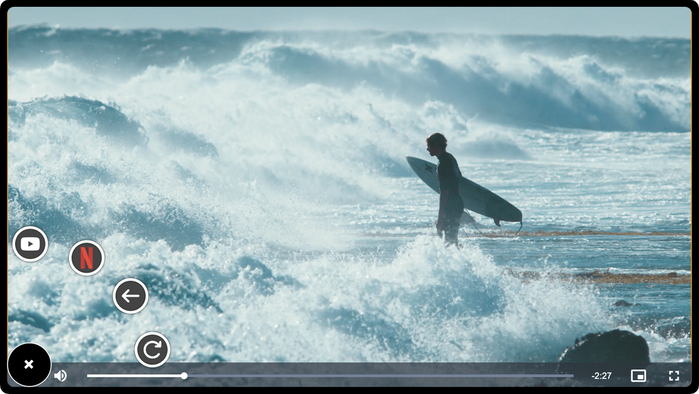

# GhostPlayer 👻

A transparent, floating desktop video player for multitasking. GhostPlayer lets you watch videos from various streaming services or local files in a resizable, semi-transparent window that always stays on top, allowing you to work or browse while you watch.



## About The Project

In a world of multitasking, switching between windows is a constant hassle. GhostPlayer solves this by providing a seamless, "ghost-like" video player that floats over your other applications. It's designed for power users, avid learners, and anyone who wants to keep an eye on a video, stream, or tutorial without sacrificing screen real estate.

Whether you're following a coding tutorial, watching a live stream, or just enjoying a movie while you work, GhostPlayer is your perfect companion.

## Features

- **Floating Window**: The player window floats on top of all other applications.
- **Adjustable Transparency**: Fine-tune the opacity from 10% to 100%. Set transparency to be always on, or have it dynamically change on mouse-over or mouse-out.
- **Multi-Service Support**: Easily switch between streaming services like YouTube and Netflix.
- **Radial Menu**: Quickly switch services, open files, and navigate history with a floating radial controller.
- **Local File Playback**: Open and watch local video files directly (`.mp4`, `.webm`, etc.).
- **Playlist & Sidebar**: Manage multiple media files and navigate your queue with the Playlist Sidebar.
- **Audio Visualizer**: Stunning, low-latency frequency visualizer that synchronizes with your audio.
- **Live Captions**: Real-time transcription using OpenAI Whisper (Local/Remote) for videos without subtitles.
- **Side Dock Mode**: Dock the player to the side of your screen. It will peek out, and you can fully reveal it by hovering over it.
- **Click-Through Mode**: Make the player window non-interactive, allowing you to click through it to the applications underneath.
- **Global Hotkey Customization**: Configure your own shortcuts with a "press-to-record" UI that adapts to your OS.
- **Cross-Platform**: Available for Windows, macOS, and Linux.

## Getting Started

### For Users

You can download the latest version of GhostPlayer from the [Releases page](https://github.com/yhbyun/ghost-player/releases).

### For Developers

To get a local copy up and running, follow these simple steps.

#### Prerequisites

- [Node.js](https://nodejs.org/) (v18 or later recommended)
- [npm](https://www.npmjs.com/)

#### Installation & Setup

1.  **Clone the repository:**
    ```sh
    git clone https://github.com/yhbyun/ghost-player.git
    cd ghost-player
    ```

2.  **Install NPM packages:**
    ```sh
    npm install
    ```

3.  **Run in Development Mode:**
    ```sh
    npm run dev
    ```

#### Building the Application

To build the application for your platform:

```bash
# For Windows
npm run build:win

# For macOS
npm run build:mac

# For Linux
npm run build:linux
```

## How to Use

- **Open a Video**:
  - Use `File > Open File...` (`Cmd/Ctrl+O`) to play a local video file.
  - Use `File > Open Location...` (`Cmd/Ctrl+L`) to stream from a URL.
  - Drag and drop video files directly onto the player window.

- **Switch Services**:
  - Navigate to the `Services` menu and select your desired streaming platform.
  - Or use the **Radial Menu** (`+` icon) for even faster switching.

- **Control Transparency**:
  - Go to `Settings > Transparency`.
  - Enable or disable transparency.
  - Adjust the opacity level.
  - Choose the transparency mode (`Always`, `Mouse Over`, `Mouse Out`).

- **Toggle Always on Top**:
  - Use the `Settings > Always on Top` checkbox.

- **Custom Shortcuts & Hotkeys**:
  - Configure global hotkeys in `Settings > Shortcuts`.
  - Use the recording UI to bind keys for Side Dock, Always on Top, etc.

- **Audio Visualizer & Captions**:
  - Enable the **Audio Visualizer** in `Settings > General`.
  - Toggle **Live Captions** using the CC button on the player (Requires OpenAI Whisper settings).

- **Enable Side Dock**:
  - Go to `Settings > Side Dock` and check `Enabled`.
  - You can also configure the visible width of the docked player.

- **Enable Click-Through (Disable Mouse)**:
  - Check the `Settings > Disable Mouse` option. To interact with the player again, you will need to bring it into focus using the OS (e.g., Alt+Tab, Dock icon) and disable the setting.

## License

Distributed under the MIT License.
